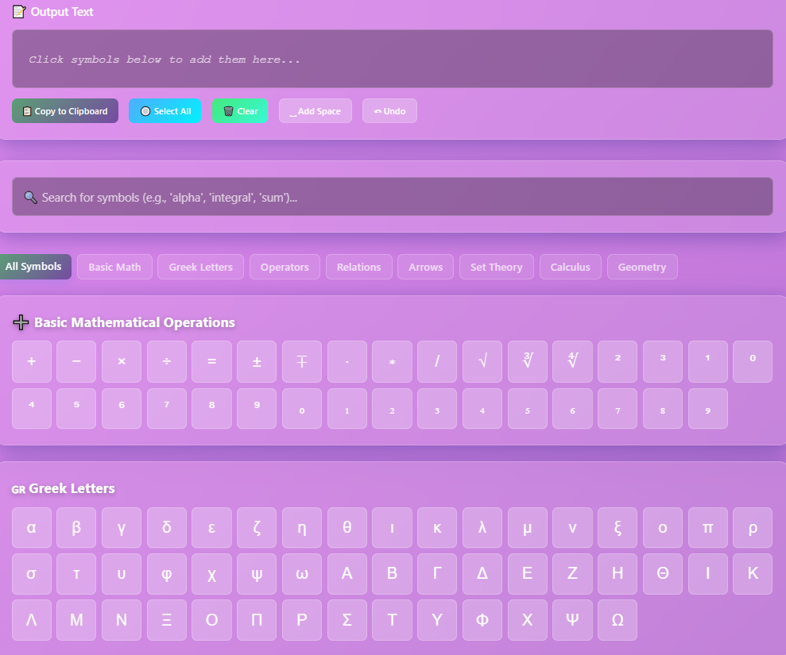

# Math Symbols Keyboard ⌨️➗✖️

A lightweight and easy-to-use **virtual keyboard** for typing common **mathematical symbols** and operators.  
Perfect for students, teachers, developers, and anyone working with math expressions on a daily basis.

---

## ✨ Features
- 🧮 Quick access to **frequently used math symbols** (√, ∑, ∞, π, ∂, ∫, ±, etc.)  
- 🎨 Clean and minimal UI  
- 📱 Responsive design (works on desktop & mobile)  
- 🔤 Supports copy & paste into any editor or app  

## 📸 Screenshots
Here’s a preview of the keyboard:

**Open the Keyboard**  
   Launch the project by opening `index.html` in your browser.  

2. **Select Symbols**  
   Click any mathematical symbol (e.g., `√`, `∑`, `∞`, `π`, `∫`) to copy it instantly to your clipboard.  

3. **Paste Anywhere**  
   Paste the copied symbol into:
   - Word processors (Word, Google Docs, LibreOffice, etc.)
   - LaTeX editors
   - Chat apps or emails
   - Programming code comments  

4. **Customize Your Layout**  
   - Edit `symbols.json` (or the configuration file) to add/remove symbols.  
   - Rearrange groups by categories: *Operators, Greek Letters, Geometry, Calculus, Logic, etc.*  
